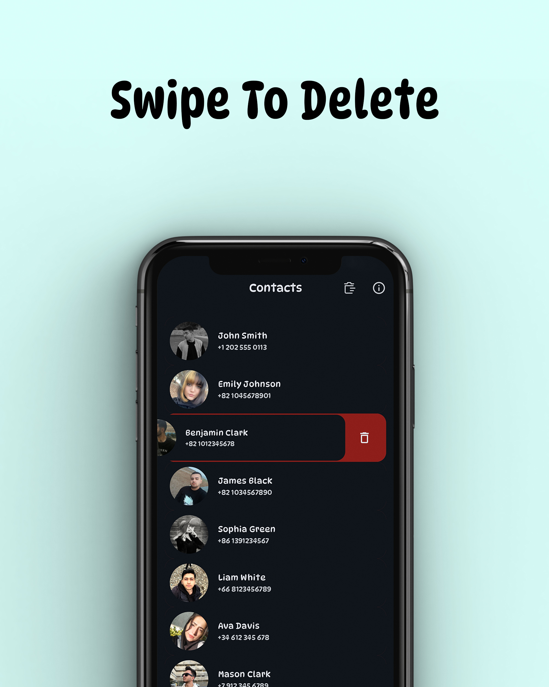
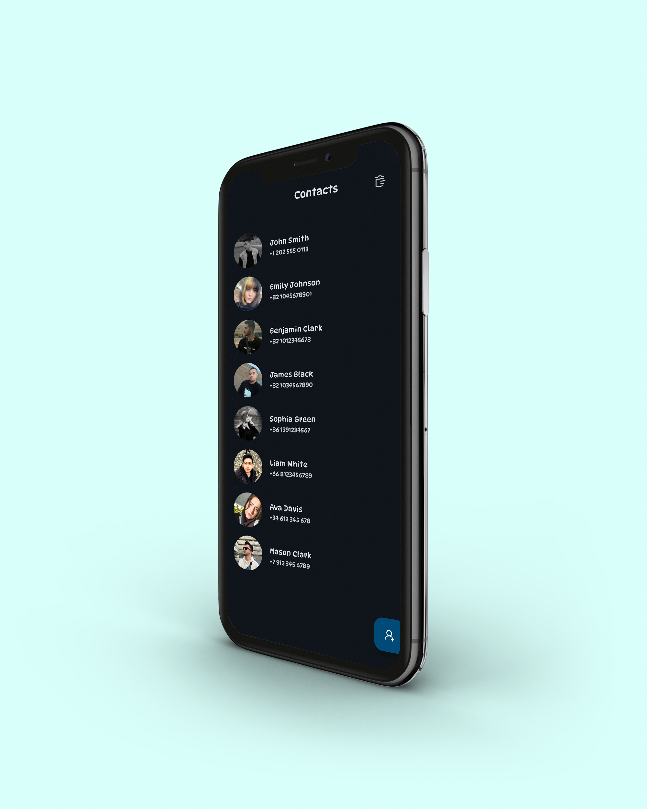
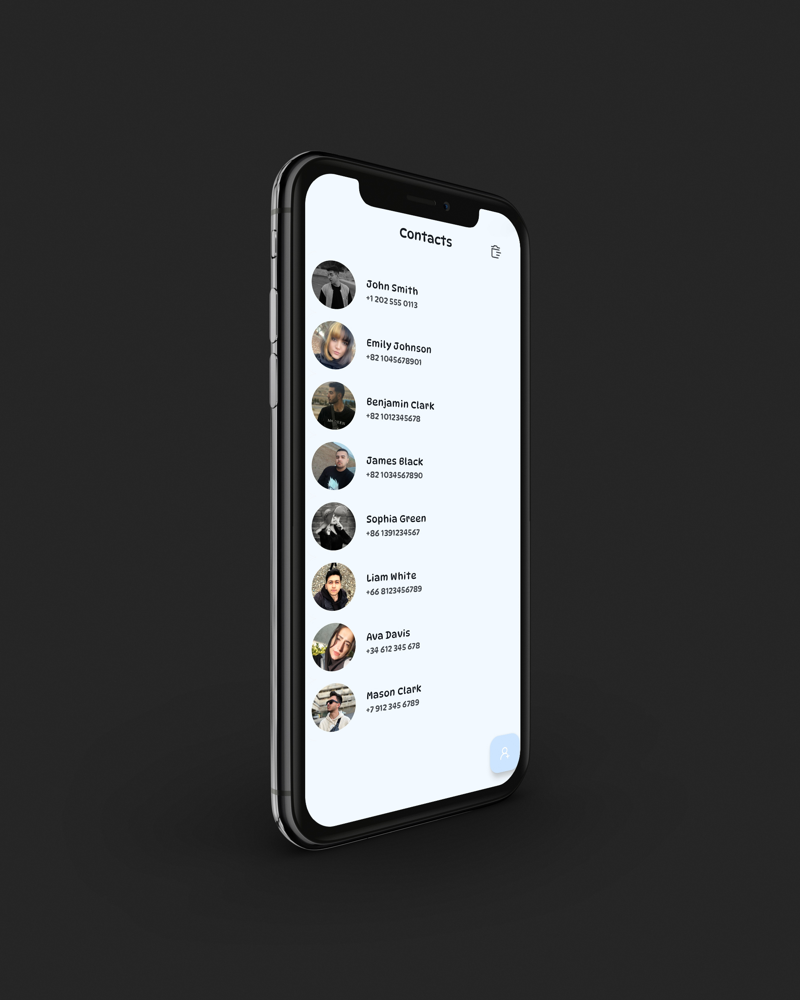

# 📱 GContact - Your Personalized Contact Manager

### 🚀 Overview
GContact is a modern contact management app built with **Android Jetpack Compose** and powered by **Dagger Hilt**, **Room Database**, and **Coroutines**. It provides a user-friendly interface to manage, add, and update your contacts seamlessly. 

### 🎯 Features
- **📝 Add and Edit Contacts:** Customize your contacts with names, phone numbers, and profile images.
- **🗑️ Delete Contacts:** Effortlessly remove single or all contacts.
- **🌙 Dark Mode Support:** Enjoy the app in both light and dark themes.

### 📂 Project Structure
- `di`: Dependency Injection modules for database and repository.
- `model`: Room Entities, DAO, and repository interfaces.
- `ui`: Jetpack Compose UI screens and components.
- `util`: Utility classes for constants and common functions.

## 🛠️ Technologies Used
- **🌐 MVVM Architecture:** Ensures a clean separation of View, ViewModel, and Model layers.
- **📦 Dependency Injection:** Powered by **Dagger-Hilt** for efficient dependency management.
- **🗄️ Room Database:** Provides a robust local data storage solution.
- **🎨 Jetpack Compose:** Simplifies UI design with modern and declarative patterns.
- **💾 Data Flow:** Utilizes **Kotlin Coroutines** and **Flow** for seamless data handling.

---

### 📸 Screenshots

<div style="display: flex; justify-content: space-between; gap: 10px;">
  
  
  
</div>

---

### 💻 Setup & Installation
1. Clone this repository:
   ```bash
   git clone https://github.com/ShervinKazemi/contact_list.git
   ```
2. Open the project in Android Studio.
3. Sync Gradle and install dependencies.
4. Run the application on an Android emulator or device.

### 🌟 Contribution Guidelines
We welcome contributions to make GContact even better! Feel free to fork the repository, create a feature branch, and submit a pull request.

---

### 👨‍💻 Author
Developed by **Shervin Kazemian**. Reach out to me at [shervink.codes@gmail.com] or connect on [LinkedIn](https://www.linkedin.com/in/shervin-kazemian).

---

Happy Coding! ✨
